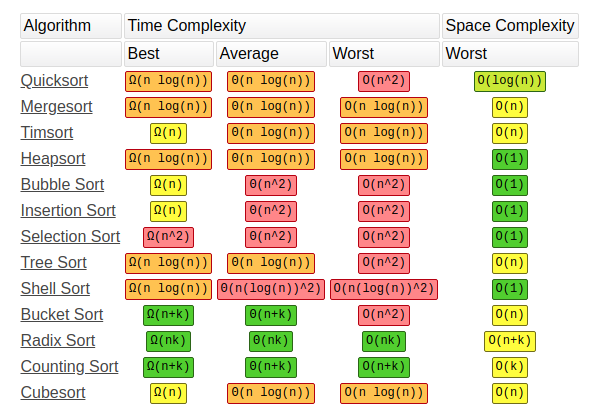
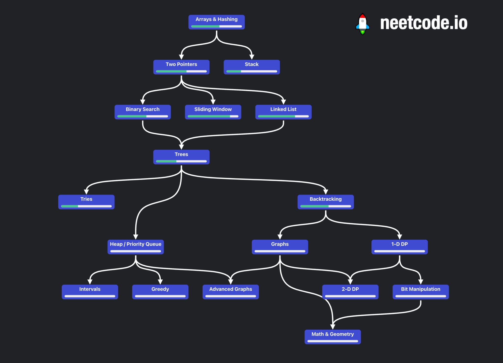

# comp-coding
Tracker repo to add leetcode, hackerrank scratch files that are either speed-optimized or space-optimized

# Progress Tracker

## DSA
- [ ] Sorting
    - - [ ] Insertion Sort
    - - [ ] Selection Sort
    - - [ ] Bubble Sort
    - - [ ] Cyclic Sort
    - - [ ] Merge Sort
    - - [ ] Quick Sort
    - [ ] Searching
        - - [ ] Linear Search
        - - [ ] Binary Search
        - - [ ] Modified Binary Search
        - - [ ] Binary Search on 2D Arrays
- [ ] Pattern printing questions
- [ ] Maths for DSA
    - - [ ] Introduction
    - - [ ] Complete Bitwise Operators
    - - [ ] Prime numbers
    - - [ ] HCF / LCM
    - - [ ] Sieve of Eratosthenes
    - - [ ] Newton's Square Root Method
    - - [ ] Number Theory
    - - [ ] Euclidean algorithm
- [ ] Space and Time Complexity Analysis
    - - [ ] Introduction
    - - [ ] Comparion of various cases
    - - [ ] Solving Linear Recurrence Relations
    - - [ ] Solving Divide and Conquer Recurrence Relations
    - - [ ] Big-O, Big-Omega, Big-Theta Notations
    - - [ ] Get equation of any relation easily - best and easiest approach
    - - [ ] Complexity discussion of all the problems we do
    - - [ ] Space Complexity
    - - [ ] Memory Allocation of various languages
    - - [ ] NP Completeness and Hardness
- [ ] Recursion
    - - [ ] Convert recursion to iteration
    - - [ ] Tail recursion
    - - [ ] Backtracking
        - - [ ] Sudoku Solver
        - - [ ] N-Queens
        - - [ ] N-Knights
        - - [ ] Maze problems
    - - [ ] Recursion String Problems
    - - [ ] Recursion Array Problems
    - - [ ] Recursion Pattern Problems
    - - [ ] Subset Questions
    - - [ ] Recursion - Permutations, Dice Throws etc Questions
- [ ] Object Oriented Programming
    - - [ ] Properties
        - - [ ] Inheritance
        - - [ ] Abstraction
        - - [ ] Polymorphism
        - - [ ] Encapsulation
    - - [ ] Overloading & Overriding
    - - [ ] Static & Non-Static
    - - [ ] Access Control
    - - [ ] Abstract Classes
    - - [ ] Singleton Class
- [ ] Linked List
    - - [ ] Singly and Doubly Linked List
    - - [ ] Circular Linked List
    - - [ ] Fast and slow pointer
    - - [ ] Cycle Detection
    - - [ ] Reversing of LinekdList
- [ ] Stacks & Queues
    - - [ ] Interview problems
    - - [ ] Push efficient
    - - [ ] Pop efficient
    - - [ ] Queue using Stack and Vice versa
    - - [ ] Circular Queue
- [ ] Dynamic Programming
    - - [x] Recursion + Recursion DP + Iteration + Iteration Space Optimized
    - - [x] Complexity Analysis
    - - [ ] 0/1 Knapsack
    - - [ ] Subset Questions
    - - [ ] Shortest Path (eg: Unique Paths I/II)
    - - [ ] Longest Common Substring/Subsequence
    - - [ ] DP on Grids
    - - [ ] LC Questions on Above topics
    - - [ ] Unbounded Knapsack
    - - [ ] Subseq questions
    - - [ ] String DP
- [ ] Trees
    - - [ ] Binary Trees
    - - [ ] Recursive Preorder, Inorder, Postorder Traversals
    - - [ ] Iterative Preorder, Inorder, Postorder Traversals
    - - [ ] LC Questions
    - - [ ] DFS
    - - [ ] BFS
    - - [ ] Morris Traversal `O(1) Space`
    - - [ ] Binary Search Trees
    - - [ ] LC Questions
    - - [ ] AVL Trees
    - - [ ] Segment Tree
    - - [ ] Fenwick Tree / Binary Indexed Tree
- [ ] Heaps
    - - [ ] Theory
    - - [ ] Priority Queue
    - - [ ] Two Heaps Method
    - - [ ] k-way merge
    - - [ ] top k elements
    - - [ ] interval problems
- [ ] Hashmaps
    - - [ ] Theory - how it works
    - - [ ] Comparisons of various forms
    - - [ ] Limitations and how to solve
    - - [ ] Map using LinkedList
    - - [ ] Map using Hash
    - - [ ] Chaining
    - - [ ] Probing
    - - [ ] Huffman-Encoder
- [ ] Graphs
    - - [ ] BFS
    - - [ ] DFS
    - - [ ] Working with graph components
    - - [ ] LC Questions
    - - [ ] Minimum Spanning Trees
    - - [ ] Kruskal Algorithm
    - - [ ] Prims Algorithm
    - - [ ] Dijkstra’s shortest path algorithm
    - - [ ] Topological Sort
    - - [ ] Kahn's Algorithm
    - - [ ] Bellman ford
    - - [ ] A* pathfinding Algorithm
- [ ] Greedy Algorithms
    - - [ ] Applications
    - - [ ] LC,GFG Questions
    - - [ ] Interview Questions
- [ ] Tries
    - - [ ] Theory - how it works
    - - [ ] Applications
    - - [ ] Insert and Search
    - - [ ] GFG articles and Questions
    - - [ ] Interview Questions

### Advanced concepts apart from interviews
- [ ] Fast IO
- [ ] File handling
- [ ] Bitwise + DP
- [ ] Extended Euclidean algorithm
- [ ] Modulo Multiplicative Inverse
- [ ] Linear Diophantine Equations
- [ ] Matrix Exponentiation
- [ ] Mathematical Expectation
- [ ] Catalan Numbers
- [ ] Fermat’s Theorem
- [ ] Wilson's Theorem
- [ ] Euler's Theorem
- [ ] Lucas Theorem
- [ ] Chinese Remainder Theorem
- [ ] Euler Totient
- [ ] NP-Completeness
- [ ] Multithreading
- [ ] Fenwick Tree / Binary Indexed Tree
- [ ] Square Root Decomposition

